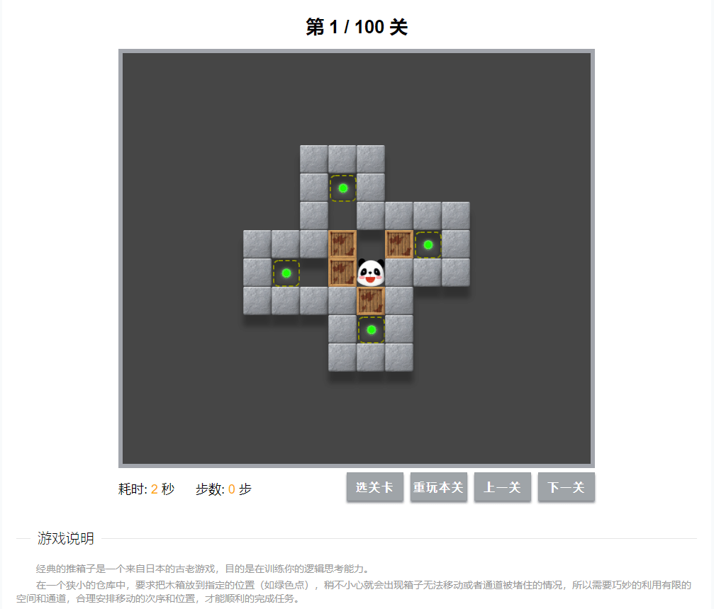

# Sokoban

#### 介绍
[原创]jQuery推箱子小游戏（100关且可扩展）,休闲,对战,娱乐,小游戏,下载即用,兼容iPad移动端,代码注释全（附源码）


##### 游戏说明

经典的推箱子是一个来自日本的古老游戏，目的是在训练你的逻辑思考能力。
在一个狭小的仓库中，要求把木箱放到指定的位置（如绿色点），稍不小心就会出现箱子无法移动或者通道被堵住的情况，所以需要巧妙的利用有限的空间和通道，合理安排移动的次序和位置，才能顺利的完成任务。


##### 玩法介绍

- 轻按键盘的方向键（上下左右），控制熊猫方向推动箱子。
- 或者点击熊猫的上下左右行走，点击熊猫和箱子的下一个空间推动箱子。

#### 效果预览



#### 使用说明

1.  引入jQuery，及js、css文件
2.  写html

```html
<div class="content">
    <div data-sokoban></div>
    <div>
        <button type="button" class="start">开始游戏</button>
    </div>
</div>
```

3.  注册插件
```js
$(function(){
    var $btn = $('.start');

    var mySokoban = new Sokoban('[data-chess]', $btn, false);
    mySokoban.restart();
    $btn.click(function() {
        mySokoban.restart();
    });
});
```

#### 更多

[原创]源码：
<a href="https://github.com/lvbee/Sokoban" target="_blank">Github仓库</a>
、
<a href="https://gitee.com/lvbee/Sokoban" target="_blank">Gitee仓库</a>
、
<a href="https://www.jq22.com/jquery-info24487" target="_blank">效果预览</a>


### 结语：

> 本插件使用了 Apache-2.0 开源许可协议，仅供学习使用，如需商用请联系原创作者！
